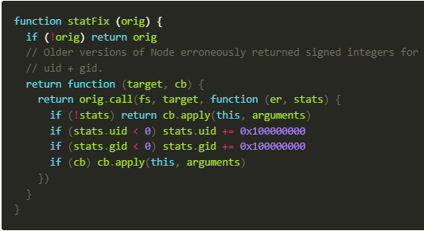
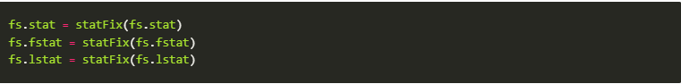

# GitBook 創建

紀錄GitBook 創建遇到的問題

正常流程

1. 安裝套件 npm install gitbook-cli -g
2. 安裝完 gitbook 套件後，使用 gitbook init 來初始化
3. 初始化後，使用 gitbook serve 在 localhost:4000 來瀏覽 gitbook

# 安裝 GitBook

使用 npm install gitbook-cli -g 來安裝

# 初始化 GitBook 錯誤1

使用 指令 gitbook init
但產生以下報錯：

    因為這個系統上已停用指令碼執行，所以無法載入 C:\...\XXX.ps1 檔案。
    如需詳細資訊，請參閱 about_Execution_Policies，網址為 https:/go.microsoft.com/fwlink/?LinkID=135170。
    位於 線路:1 字元:3
    + . 'C:\Users\ruyut\Documents\WindowsPowerShell\Microsoft.PowerShell_pr ...
    +   ~~~~~~~~~~~~~~~~~~~~~~~~~~~~~~~~~~~~~~~~~~~~~~~~~~~~~~~~~~~~~~~~~~~
        + CategoryInfo          : SecurityError: (:) [], PSSecurityException
        + FullyQualifiedErrorId : UnauthorizedAccess

解決方法：
以系統管理員身分打開terminal
使用 指令 Get-ExecutionPolicy 可以查看當前的規則，預設的規則為 Restricted

    AllSigned: 所有腳本都可以執行，指令碼與設定檔則是需由信任的發行者簽署
    Bypass: 不會封鎖任何項目，且不會顯示警告或提示
    Default: 預設
    RemoteSigned: 腳本和組態檔需要數位簽章，除非在本機電腦上撰寫
    Undefined: 未設定
    Unrestricted: 非 Windows 電腦使用的原則

使用指令 Set-ExecutionPolicy RemoteSigned 解除限制

# 初始化 GitBook 錯誤2

使用 指令 gitbook init 又報錯，
提示的錯誤為：cb.apply is not a function

解決方法：找到錯誤的檔案
錯誤的檔案為：/usr/local/lib/node_modules/gitbook-cli/node_modules/npm/node_modules/graceful-fs/polyfills.js
此為 graceful-js npm 包

問題給出的函數為：

找到文件內的這段代碼

將他 註釋掉 (Ctrl + /)
存檔後，再回到 Terminal 使用指令 gitbook init 即可成功使用

# 添加文檔 book.json

以下是我使用的文檔

    {
        "plugins": [  "anchor-navigation-ex", "edit-link", "copy-code-button", "theme-comscore", "ga" ],
        "pluginsConfig": {
        "fontSettings": {
            "theme": "night",
            "family": "sans"
        },
        "theme-default": {
            "showLevel": false
        },
        "anchor-navigation-ex": {
            "showLevel": false,
            "associatedWithSummary": false,
            "printLog": false,
            "multipleH1": false,
            "mode": "float",
            "showGoTop":true,
            "float": {
                "floatIcon": "fa fa-navicon",
                "showLevelIcon": false,
                "level1Icon": "fa fa-hand-o-right",
                "level2Icon": "fa fa-hand-o-right",
                "level3Icon": "fa fa-hand-o-right"
            },
            "pageTop": {
                "showLevelIcon": false,
                "level1Icon": "fa fa-hand-o-right",
                "level2Icon": "fa fa-hand-o-right",
                "level3Icon": "fa fa-hand-o-right"
            }
        },
        "edit-link": {
            "base": "https://github.com/<你的 GitHub 帳號>/demo-build-and-publish-gitbook/edit/master/",
            "label": "Edit This Page"
          },
        "ga": {
            "token": ""
          }
        }
    }

使用 gitbook install 安裝這些套件

# 使用 gitbook serve

無報錯 使用成功 打開 localhost:4000 即可瀏覽你的 gitbook 啦!!

# 使用 gitbook build

如要製作 Static 頁面，使用指令 gitbook build 即可!!